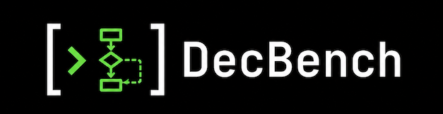

# DecBench

<p align="center">
  <a href="https://decbench.com">
    
  </a>
</p>

Over the last 30 years, binary decompilers have made the steady march towards _perfect decompilation_: where decompilers recover the exact source code.
However, that _perfect_ has yet to be measured meaningfully, and is often defined across multiple axes. 

DecBench is an experimental benchmark to compare decompilers, and modern LLMs, at the task of recovering _exact_ source code.
This benchmark defines new metrics and datasets that represent the various directions of exactness for decompilers: structure, types, and precise recompilability. 
This benchmark is also _living_: as new decompiler/LLMs are released, their scores will be added to the leaderboard!
Community feedback is welcome!

See the live page for the latest results, insights, and purpose statement: [https://decbench.com](https://decbench.com)

## Metrics

DecBench evaluates decompilers using three core metrics:

| Metric | What it measures | How it works |
|--------|-----------------|--------------|
| **Structural Correctness (GED)** | Control flow recovery | Graph Edit Distance between source and decompiled CFGs using [cfgutils](https://github.com/angr/cfgutils) |
| **Type Correctness** | Variable type recovery | Compares decompiled variable types against DWARF debug info |
| **Recompilation Bytematch** | Recompilable, semantically-equivalent code | Recompiles each decompiled function with the **original toolchain** (matching its format/arch/opt flags) after a compilability **fixup** pass, then diffs the assembly via Jaccard similarity with linker-dependent operands normalized away |

A **Union** score tracks the percentage of functions where a decompiler achieves a perfect match on *one of three* metrics — i.e. the source was "perfect" by one direction.

## Quickstart
DecBench runs a four-stage pipeline:

```
Source Code (TOML config)
    --> Compile (gcc / cross / MinGW, multiple -O levels)
    --> Decompile (angr, phoenix, Ghidra, IDA, Binary Ninja, ...)
    --> Evaluate (GED + Type Match + Byte Match)
    --> Scoreboard + HTML Report
```

You can access/reproduce all of them using our command-line utility and [public dataset](https://huggingface.co/datasets/noelo-lab/decbench-dataset).

```bash
# Install
pip install -e ".[dev]"

# Run full pipeline on a project
decbench run projects/sailr/coreutils.toml

# Run with specific decompilers and metrics
decbench run project.toml -d angr -d ghidra -m ged -m type_match -m byte_match

# Evaluate a single binary
decbench evaluate binary.elf -s source.c

# Generate HTML report from results
decbench report results/scoreboard.toml -o report.html

# List available decompilers and metrics
decbench list-decompilers
decbench list-metrics
```

### Byte-match fairness (fixup + normalization)

Raw decompiler output rarely recompiles as-is (pseudo-types like `undefined4`,
illegal tokens like `GLIBC_2.2.5::stderr`), so naive recompilation scores almost
everything 0. To measure *logic* recovery fairly, byte-match applies the same
two passes to every decompiler: a **compilability fixup**
(`decbench/metrics/fixup.py`) — a deterministic, gcc-diagnostic-driven
self-repair loop that injects *only* what the compiler reports missing, never
redefining what the decompiler declared (sailr O0 compile rates: ~20–79% raw →
~83–95% fixed, per decompiler) — and **operand normalization**, which blanks
link-time-dependent operands (branch/call targets, `[rip±x]` displacements)
before diffing. Type recovery is scored separately (Type Correctness), so fixing
types just to compile does not inflate this metric; each function also records
whether it recompiled, surfaced as the per-decompiler **compile rate**.

## Generating results

`decbench run` works for a single project, but real benchmark runs use the
resilient drivers in `scripts/` — they checkpoint per project (so a multi-hour
run survives crashes) and use the `spawn` multiprocessing context (the default
`fork` deadlocks workers once angr's threads are live).

```bash
# 1. Compile every project at every opt level into a results tree.
GHIDRA_INSTALL_DIR=/path/to/ghidra \
  python scripts/compile_all.py results/sailr_full 16        # 16 workers

# 2. Decompile + evaluate + write the scoreboard, function data, and report.
DECBENCH_WORKERS=40 DECBENCH_DECOMPILERS=angr,ghidra \
  GHIDRA_INSTALL_DIR=/path/to/ghidra \
  python scripts/run_benchmark.py results/sailr_full
#   Restart resumes from per-project checkpoints.
#   `... results/sailr_full -- grep` limits to named projects.
```

This produces, under `results/sailr_full/`:

- `scoreboard.toml` — machine-readable per-metric + overall scores
- `function_results.json` — the per-function dataset the HTML report embeds
  (values, perfect flags, dataset tags, side-by-side **samples** with source,
  **hardest** functions, per-decompiler **compile rates**)
- `<opt>/<project>/{compiled,decompiled,evaluated}/` — intermediate artifacts

### Re-scoring byte-match without re-decompiling

Decompilation is the slow part. To re-score only byte-match over an existing tree
(reusing its stored `decompiled/*.c` and `compiled/` binaries), run the offline
scripts, then re-render — `reeval_ged.py` / `reeval_typematch.py` work the same way:

```bash
python scripts/reeval_bytematch.py results/sailr_full 40      # -> byte_match_new.json (parallel, resumable)
python scripts/rebuild_function_data.py results/sailr_full    # -> refreshed function_results.json + scoreboard.toml
decbench report results/sailr_full/scoreboard.toml -o results/sailr_full/report.html
```

## Rendering the site

Two commands render the **same page** from the same skeleton and the same
content; they differ only in how it is delivered.

| Command | Output | Use it when |
|---------|--------|-------------|
| `decbench report` | one self-contained `.html` (~7.1 MB) | you want a single file to open locally, email, or archive — CSS, JS, font and all data are inlined, so it works over `file://` |
| `decbench site build` | a split tree in `site/` (~7.0 MB) | you are publishing to GitHub Pages — assets and data are separate files the browser caches, and only ~0.10 MB loads before first paint |

```bash
# Single self-contained file. Takes a SCOREBOARD path; if a sibling
# function_results.json exists, the report is fully interactive.
decbench report results/full_run/scoreboard.toml -o results/full_run/report.html

# Deployable Pages tree. Takes a RESULTS TREE, and requires its
# function_results.json — every view is computed from per-function data.
decbench site build results/full_run -o site/
```

### Publishing to GitHub Pages

CI **never builds the site** — building needs every decompiler, a ~1.9 GB Joern,
and ~15 GB of compiled binaries. The maintainer builds locally and commits the
tree; [`.github/workflows/pages.yml`](.github/workflows/pages.yml) only uploads
what is already in `site/`.

```bash
decbench site build results/full_run -o site/      # 1. build locally
git add site && git commit -m 'site: refresh'      # 2. commit it (site/ is deliberately NOT gitignored)
git push                                           # 3. Actions deploys it
```

The workflow triggers on pushes to `main` that touch `site/**`, failing loudly if
`site/index.html` or `site/data/aggregates.json` is missing; the tree's data
contract is [`docs/SITE_DATA_SCHEMA.md`](docs/SITE_DATA_SCHEMA.md).

### Views

The report is a **single-page app** (no server, no external assets — the web font
is vendored) themed in a terminal aesthetic. A left **sidebar** switches views and
holds a **dataset selector** (`unoptimized` / `optimized` / `inlined` / `large` /
`sample-set`) plus a normalize-failures toggle. Every aggregate for those
selectors is precomputed at build time, so switching is a lookup rather than a
client-side recompute.

| View | What it shows |
|------|---------------|
| **Leaderboard** | swebench-style ranked table — one row per decompiler, columns for Union + each metric's perfect % + errors; sortable by any column. The page the site opens on |
| **Distance** | raw edit distance to a perfect result per metric (lower is better) — mean, median, and how many functions are already at 0; a finer signal than the leaderboard's perfect rate. Also holds the per-decompiler **Compiles** rate table |
| **View** | original source side-by-side with one chosen decompiler's output, across easy/medium/hard difficulty tiers (~100 functions each), with per-metric scores |
| **Insights** | a maintainer's reading of what the numbers actually say |
| **Changelog** | the dated change log, injected from the repo-root `CHANGELOG.md` at build time |
| **About** | why the benchmark exists, the three metric goals (with visualizations), and the dataset/corpus tables |

### Editing the site's text

**Every string a maintainer might want to reword lives in
`decbench/rendering/content/` — not in `html.py`.** Edit a file there, re-render,
done: no benchmark re-run, no Python.

| File | Holds |
|------|-------|
| `<view>.md` | each view's title and prose — `leaderboard.md`, `distance.md`, `view.md`, `insights.md`, `changelog.md`, `about.md` |
| `site.toml` | brand block, sidebar, footer, banners, side stats, and which decompilers are site-hidden / sample-set-only |
| `views.toml` | the view registry — which views exist, nav order + labels, which is `default`, which need function data |
| `metrics.toml` | per-metric display name, short column label, order, and the definition of *perfect* |
| `datasets.toml` | the 5 dataset presets' labels + descriptions, and which is `default` |
| `decompilers.toml` | the decompiler registry — official display names, project links, and version labels, rendered wherever the site names a decompiler |
| `categories.toml` | the software-type taxonomy on the About page's dataset tables |

The `.md` conventions are documented in `leaderboard.md`'s header. A view's `id`
in `views.toml` must match its `<id>.md`. `datasets.toml` owns only preset
*presentation* — which functions are *in* a preset is scoring logic in
`decbench/scoring/datasets.py`.

## Finding improvement cases

`decbench improvements` mines a results tree for the concrete functions where one
decompiler beats another on a metric — a targeted to-do list for whoever is
improving the losing decompiler. It reads the `function_results.json` produced by
a run and, per function, compares a **base** decompiler (the winner) against a
**target** (the one to improve), respecting the metric's direction.

The example below uses **GED** (structural correctness — CFG graph edit distance,
where **lower is better** and `0` is a perfect structural match):

```bash
# Where does angr (base) structurally beat ghidra (target)? -m ged is the default.
decbench improvements results/sailr_full -b angr -t ghidra -m ged

# Strongest signal only: functions angr recovers *perfectly* (GED == 0) while
# ghidra does not — the clearest wins to learn from.
decbench improvements results/sailr_full -b angr -t ghidra -m ged --perfect-only
```

Each row locates the function on disk — binary, path to the compiled binary, and
the function symbol + address — so you can jump straight to it:

```
angr beats ghidra on 'ged' — 356 case(s)  [base-perfect only]
metric: ged  (lower is better, perfect = 0)
showing 1 of 356, largest margin first

── libacl / O0 / getfacl ──  results/sailr_full/O0/libacl/compiled/getfacl
   0x281a  get_list   angr=0*  ghidra=38  Δ38
```

`Δ` is how much better the base scored; `*` marks a perfect base score. Cases are
ordered by the largest base advantage first. See `decbench improvements --help`
for the full flag set (metric direction is applied automatically, `--limit`,
JSON output); `RESULTS` may be a results directory or a `function_results.json`
file directly.

## Published datasets

Benchmark runs can be published as a public, reusable dataset (compiled
binaries, preprocessed sources, source/decompiled CFGs, per-function results and
scores) and pulled back down without recompiling or re-decompiling:

```bash
# Download a published config: sample-set / large / unoptimized / optimized /
# inlined / full.
decbench download sample-set --dest ./decbench-data
#   (thin alias for the standalone `decbench-data` consumer package; fetch a
#    subset with --include binaries,sources,cfgs,results,scores)

# Publish a results tree to the dataset repo layout.
python scripts/publish_dataset.py results/full_run --dest ~/github/decbench-dataset
```

See [docs/DATASET_PUBLISHING.md](docs/DATASET_PUBLISHING.md) for the repo layout,
the publisher, and the lightweight consumer CLI.

## Project Configuration

Projects are defined via TOML files:

```toml
name = "coreutils"
version = "9.4"
source_remote = "https://ftp.gnu.org/gnu/coreutils/coreutils-9.4.tar.xz"
remote_type = "tar"
source_dir = "src"
make_cmd = "make"
pre_make_cmds = ["./configure --quiet"]

[compilation]
optimization_levels = ["O0", "O2"]
base_flags = ["-g", "-fno-inline", "-fno-builtin"]
```

## Supported Decompilers

Each backend subclasses the `Decompiler` ABC and registers by name; a
decompiler's identity is `name` or `name@version` (e.g. `ghidra@12.0` vs
`ghidra@12.1`), so multiple versions can be benchmarked as distinct columns.
`decbench list-decompilers` shows what's available on the current machine.

- **angr** - Open-source binary analysis framework (default SAILR structurer)
- **phoenix** - angr driven with the Phoenix structurer (a distinct decompiler)
- **Ghidra** - NSA's open-source reverse engineering tool (via pyghidra)
- **IDA Pro** - Commercial decompiler (via idalib, IDA 9+)
- **Binary Ninja** - Commercial decompiler (headless, needs a license)
- **kuna** - experimental structuring backend
- **dewolf** - FKIE-CAD's research decompiler (Binary-Ninja-based, run out of process)

The canonical `angr`/`ghidra`/`ida`/`binja` backends drive each tool's own API
directly (no `declib`). Additional backends run in Docker: **RetDec**, **Reko**,
and **r2dec** (build images with `decbench decompiler-build <name>`). Two **LLM
coding agents** — **codex** and **claude-code** — are also registered as
decompilers, one agentic CLI call per function; they run on the `sample-set`
slice only (see [docs/LLM_DECOMPILERS.md](docs/LLM_DECOMPILERS.md)).

## Results

After running the pipeline, DecBench generates:

- **Scoreboard** (`scoreboard.toml`) — machine-readable per-metric + overall scores
- **Function data** (`function_results.json`) — per-function dataset embedded by the report
- **HTML Report** — the interactive single-page site described in [Rendering the site](#rendering-the-site)
- **Per-binary TOML files** — detailed per-function metric values

`decbench run` also prints a text scoreboard to the terminal, e.g.:
```
============================================================
  DecBench Scoreboard
  Functions: 2,309 | Binaries: 2
============================================================

GED:
  > angr                       48.8%

BYTE_MATCH:
  > angr                        1.7%

TYPE_MATCH:
  > angr                        0.0%

UNION (perfect on at least one metric):
  > angr                        0.0%
============================================================
```

## Development

```bash
# Run tests
pytest

# Linting and formatting
ruff check .
black .
mypy decbench
```

## Architecture

```
decbench/
  pipeline/         # compile -> decompile -> evaluate orchestration
  metrics/          # ged.py, type_match.py, byte_match.py, fixup.py
  decompilers/      # raw angr/ghidra/ida/binja + dewolf, dockerized, LLM agents
  compilers/        # gcc plugin
  models/           # Pydantic data models
  scoring/          # aggregation, scoreboard, datasets, report extras
  rendering/        # the report + the deployable site
    html.py         #   skeleton assembly only — no CSS, no JS, no prose
    aggregate.py    #   build-time aggregation -> the site's JSON payloads
    site.py         #   the split GitHub Pages tree (decbench site build)
    content.py      #   loader for content/
    content/        #   ALL editable text: *.md per view + site/views/metrics/
                    #   datasets/decompilers/categories .toml
    assets/         #   app.css, app.js, vendored font
  utils/            # binfmt.py, source_extract.py, cfg.py
  cli.py            # Click-based CLI
scripts/            # scalable run drivers + offline metric re-eval/rebuild
site/               # the built Pages tree, committed (see "Rendering the site")
docs/               # ADDING_A_DECOMPILER.md, DATASET_PUBLISHING.md,
                    # LLM_DECOMPILERS.md, SITE_DATA_SCHEMA.md
```

## Dependencies

- Python 3.10+
- [angr](https://angr.io/) - Binary analysis and decompilation
- [pyjoern](https://github.com/angr/pyjoern) - Source CFG extraction
- [cfgutils](https://github.com/angr/cfgutils) - Graph Edit Distance
- [pyelftools](https://github.com/eliben/pyelftools) - ELF/DWARF parsing
- [capstone](https://www.capstone-engine.org/) - Disassembly for byte matching
- [diff-match-patch](https://github.com/google/diff-match-patch) - Assembly diffing

## License

MIT
