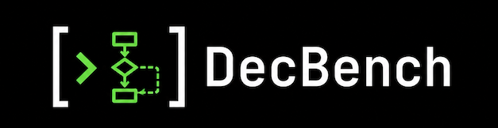

# DecBench

<p align="center">
  <a href="https://decbench.com">
    
  </a>
</p>

Over the last 30 years, binary decompilers have made the steady march towards _perfect decompilation_: where decompilers recover the exact source code.
However, that _perfect_ has yet to be measured meaningfully, and is often defined across multiple axes. 

DecBench is an experimental benchmark to compare decompilers, and modern LLMs, at the task of recovering _exact_ source code.
This benchmark defines new metrics and datasets that represent the various directions of exactness for decompilers: structure, types, and precise recompilability. 
This benchmark is also _living_: as new decompiler/LLMs are released, their scores will be added to the leaderboard!
Community feedback is welcome!

See the live page for the latest results, insights, and purpose statement: [https://decbench.com](https://decbench.com)

**Questions? Join our Discord**:

[](https://discord.gg/vAQ8BKUPXv)

## Metrics

DecBench evaluates decompilers using three core metrics:

| Metric | What it measures | How it works |
|--------|-----------------|--------------|
| **Structural Correctness (GED)** | Control flow recovery | Graph Edit Distance between source and decompiled CFGs using [cfgutils](https://github.com/angr/cfgutils) |
| **Type Correctness** | Variable type recovery | Compares decompiled variable types against DWARF debug info |
| **Recompilation Bytematch** | Recompilable, semantically-equivalent code | Recompiles each decompiled function with the **original toolchain** (matching its format/arch/opt flags) after a compilability **fixup** pass, then diffs the assembly via Jaccard similarity with linker-dependent operands normalized away |

A **Union** score tracks the percentage of functions where a decompiler achieves a perfect match on *one of three* metrics, i.e. the source was "perfect" by one direction.

Full methodology, including fairness edits to decompilers, is in [docs/metrics.md](docs/metrics.md).

## Quickstart
DecBench runs a three-stage pipeline (plus reporting):

```
Source Code (TOML config)
    --> Compile (gcc / cross / MinGW, multiple -O levels)
    --> Decompile (angr, Ghidra, IDA, Binary Ninja, ...)
    --> Evaluate (GED + Type Match + Byte Match)
    --> Scoreboard + HTML Report
```

You can access/reproduce all of them using our command-line utility and [public dataset](https://huggingface.co/datasets/noelo-lab/decbench-dataset).

```bash
# Install
pip install -e ".[dev]"

# Run full pipeline on a project
decbench run projects/sailr/coreutils.toml

# Run with specific decompilers and metrics
decbench run project.toml -d angr -d ghidra -m ged -m type_match -m byte_match

# Evaluate a single binary
decbench evaluate binary.elf -s source.c

# Generate HTML report from results
decbench report results/scoreboard.toml -o report.html

# List available decompilers and metrics
decbench list-decompilers
decbench list-metrics
```

### Compete externally

If you have a decompiler you would like to add to DecBench, but would prefer to not open-source it or add a [harness](./decbench/decompilers/raw/), you can compete on the 250-function [sample-set](https://decbench.com/leaderboard/?dataset=sample-set) dataset.

You can compete on it by downloading the dataset, decompiling each requested function, and sending back the zip to `decbench@zionbasque.com` or opening an issue.
This does not require installing decbench, and does not require you to build the site.

If you would rather your decompiled output was not republished, say so when you send the results: we can score and rank you exactly like everyone else while withholding the code itself, so the View page shows `private` where your output would be and nothing ships to the [dataset](https://huggingface.co/datasets/noelo-lab/decbench-dataset).

```bash
# download the dataset
curl -L https://huggingface.co/datasets/noelo-lab/decbench-dataset/resolve/main/kits/decbench-evalkit-sample-set.zip -o kit.zip && unzip kit.zip

# follow the README and decompile requested functions
cd decbench-evalkit-sample-set && cat README.md

# package and send the results 
python package.py 
```

## Generating results

`decbench run` works for a single project, but real benchmark runs use the
resilient drivers in `scripts/` — they checkpoint per project, so a multi-hour
run survives crashes. Driver internals and every env knob:
[docs/benchmarking.md](docs/benchmarking.md).

```bash
# 1. Compile every project at every opt level into a results tree.
GHIDRA_INSTALL_DIR=/path/to/ghidra \
  python scripts/compile_all.py results/sailr_full 16        # 16 workers

# 2. Decompile + evaluate + write the scoreboard, function data, and report.
DECBENCH_WORKERS=40 DECBENCH_DECOMPILERS=angr,ghidra \
  GHIDRA_INSTALL_DIR=/path/to/ghidra \
  python scripts/run_benchmark.py results/sailr_full
#   Restart resumes from per-project checkpoints.
#   `... results/sailr_full -- grep` limits to named projects.
```

This produces, under `results/sailr_full/`:

- `scoreboard.toml` — machine-readable per-metric + overall scores
- `function_results.json` — the per-function dataset the HTML report embeds
  (values, perfect flags, dataset tags, side-by-side **samples** with source,
  per-decompiler **compile rates**)
- `<opt>/<project>/{compiled,decompiled,evaluated}/` — intermediate artifacts

The `compiled/` directories keep the preprocessed `.i` sources alongside the
binaries. They are **required**, not build debris: GED's source-side CFGs are
parsed exclusively from them, and without the `.i` files GED is silently
skipped for the entire run (why: [docs/metrics.md](docs/metrics.md)).

## Republishing the site

Most users never need to build the site. It only needs republishing when the
published results change: new runs, new decompilers, updated scores. CI never
builds it: the tree under `site/` is built locally, committed, and deployed by
Actions. The build + publish guide (delivery modes, the three-step publish
flow, and where the site's text lives) is in [docs/site.md](docs/site.md).

## Finding improvement cases

You are a decompiler developer and you want to find ways to improve your decompiler based on these results?
Use the `improvements` command, which can help you find good starting cases. 

The example below uses **GED** (structural correctness — CFG graph edit distance, where **lower is better** and `0` is a perfect structural match):
```bash
# Where does angr (base) structurally beat ghidra (target)? -m ged is the default.
decbench improvements results/sailr_full -b angr -t ghidra -m ged
decbench improvements results/sailr_full -b angr -t ghidra -m ged --perfect-only
```

Each row locates the function on disk — binary, path to the compiled binary, and the function symbol + address — so you can jump straight to it:
```
angr beats ghidra on 'ged' — 356 case(s)  [base-perfect only]
metric: ged  (lower is better, perfect = 0)
showing 1 of 356, largest margin first

── libacl / O0 / getfacl ──  results/sailr_full/O0/libacl/compiled/getfacl
   0x281a  get_list   angr=0*  ghidra=38  Δ38
```

## AI Policy
[DecBench](https://github.com/Noelo-Lab/decbench), unlike [Kuna](https://github.com/Noelo-Lab/kuna), **DOES NOT** allow fully autonomous contributions.
This is relevant for Issues, Commit Comments, and PRs that are automatically created and submitted by an AI system (Codex, Claude, Kimi, ...).
We do allow AI generated code, and, in fact, much of this repo contains code created by a coding agent.
However, nearly ever line added has been added and is _owned_ by the user that authorized it, with the core ideas being their own.
Autonomous research is valuable, but not desired on this project.

Autonmous contributions may be closed without reason. 
Again, this is not a ban on AI, but a ban on end-to-end automation (open issue, PR, comments).
Please be responsible and own the content you write for DecBench.

## Citation

If you use DecBench for research or to improve your tools, consider citing or mentioning it
in your project. Public acknowledgement helps gain support to keep DecBench it running:

```bibtex
@misc{decbench2026,
  author = {{Noelo Lab}},
  title = {{DecBench}: A Benchmarking Suite for Evaluating Perfect Decompilation},
  year = {2026},
  url = {https://github.com/Noelo-Lab/decbench}
}
```
